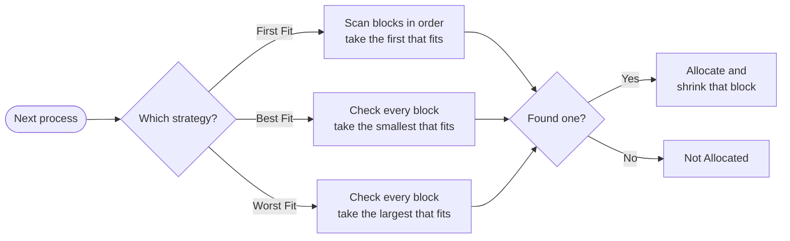

<div align="center">


<br/>

<a href="https://github.com/vxwshxl/ShellScripts">
  
</a>

<br/>


</div>

---

## 📑 Contents

- [⚡ Quick start](#-quick-start)
- [🧠 Memory allocation (First, Best, Worst Fit)](#-memory-allocation)
- [⏱️ CPU scheduling (FCFS)](#%EF%B8%8F-cpu-scheduling)
- [🔢 Basic programs](#-basic-programs)
- [🛠️ Troubleshooting](#%EF%B8%8F-troubleshooting)

---

## ⚡ Quick start

```bash
# 1. Clone the repo
git clone https://github.com/vxwshxl/ShellScripts.git
cd ShellScripts

# 2. Make every script executable (one time only)
chmod +x *.sh

# 3. Run any script
./prime.sh
```

> [!TIP]
> Every script is interactive: run it, type the numbers it asks for, and press <kbd>Enter</kbd> after each one.

> [!IMPORTANT]
> Run **`fcfs.sh`** with `bash fcfs.sh`, not `./fcfs.sh`. It starts with `#!/bin/zsh` but counts arrays from 0, which only works in Bash.

---

## 🧠 Memory allocation

Three ways to place processes into free memory blocks. Each process goes into one block, and that block shrinks by the process size, so what's left can still take a later process.

| Script | Strategy | Picks the block that is… | Run |
|:--|:--|:--|:--|
| 🥇 [`first_fit.sh`](first_fit.sh) | **First Fit** | the *first* one big enough | `./first_fit.sh` |
| 🎯 [`best_fit.sh`](best_fit.sh) | **Best Fit** | the *smallest* one big enough | `./best_fit.sh` |
| 🐘 [`worst_fit.sh`](worst_fit.sh) | **Worst Fit** | the *largest* one big enough | `./worst_fit.sh` |



### 🧪 Try it with the classic example

**Blocks:** `100 500 200 300 600` &nbsp;•&nbsp; **Processes:** `212 417 112 426`

```bash
printf '5\n100\n500\n200\n300\n600\n4\n212\n417\n112\n426\n' | ./best_fit.sh
```

| Process | Size | 🥇 First Fit | 🎯 Best Fit | 🐘 Worst Fit |
|:--:|:--:|:--:|:--:|:--:|
| P1 | 212 | B2 | B4 | B5 |
| P2 | 417 | B5 | B2 | B2 |
| P3 | 112 | B2 | B3 | B5 |
| P4 | 426 | ❌ | ✅ B5 | ❌ |

> [!NOTE]
> Best Fit is the only strategy here that fits all four processes.

<details>
<summary><b>🖥️ Sample output: <code>first_fit.sh</code></b></summary>

```text
First Fit
-----------------------------------------------
Process    Process Size    Block No.
-----------------------------------------------
P1         212             2
P2         417             5
P3         112             2
P4         426             Not Allocated
-----------------------------------------------

Block    Original Size    Remaining Size
B1       100              100
B2       500              176
B3       200              200
B4       300              300
B5       600              183
```

</details>

---

## ⏱️ CPU scheduling

| Script | What it does | Run |
|:--|:--|:--|
| 🚦 [`fcfs.sh`](fcfs.sh) | **First Come First Serve**: waiting time, turnaround time and their averages | `bash fcfs.sh` |

<details>
<summary><b>🖥️ Sample output: burst times <code>5 3 8</code></b></summary>

```text
Process    Burst Time    Waiting Time    Turnaround Time
---------------------------------------------
P1          5             0              5
P2          3             5              8
P3          8             8              16
---------------------------------------------
Average Waiting Time    = 4.33
Average Turnaround Time = 9.66
```

</details>

---

## 🔢 Basic programs

| | Script | What it does | Run |
|:--:|:--|:--|:--|
| ➕ | [`add.sh`](add.sh) | Adds two numbers | `./add.sh` |
| 🔁 | [`sum.sh`](sum.sh) | Sum of 1 to *n* | `./sum.sh` |
| ⚖️ | [`oddeven.sh`](oddeven.sh) | Odd or even check | `./oddeven.sh` |
| 🔍 | [`prime.sh`](prime.sh) | Prime number check | `./prime.sh` |
| ❗ | [`factorial.sh`](factorial.sh) | Factorial of a number | `./factorial.sh` |
| 🌀 | [`fibonacci.sh`](fibonacci.sh) | Fibonacci series up to 500 | `./fibonacci.sh` |
| 🤝 | [`gcd.sh`](gcd.sh) | GCD of two numbers (Euclid) | `./gcd.sh` |
| 🔄 | [`reverse.sh`](reverse.sh) | Reverses the digits of a number | `./reverse.sh` |
| 💰 | [`si.sh`](si.sh) | Simple interest and total amount | `./si.sh` |
| ⭕ | [`circle.sh`](circle.sh) | Area of a circle | `./circle.sh` |
| 📐 | [`circumAreaCircle.sh`](circumAreaCircle.sh) | Circumference and area of a circle | `./circumAreaCircle.sh` |

---

## 🛠️ Troubleshooting

| 😵 Problem | ✅ Fix |
|:--|:--|
| `permission denied: ./script.sh` | Run `chmod +x script.sh` once |
| `no matches found: bt[i]` in `fcfs.sh` | Run it with `bash fcfs.sh` |
| `bc: command not found` (circle scripts, FCFS averages) | Install it: `sudo apt install bc` on Linux (macOS already has it) |
| Want to feed input without typing | Pipe it in: `printf '7\n' \| ./prime.sh` |

---

<div align="center">

**Made with 🐚 and ☕ by [vxwshxl](https://github.com/vxwshxl)**


</div>
